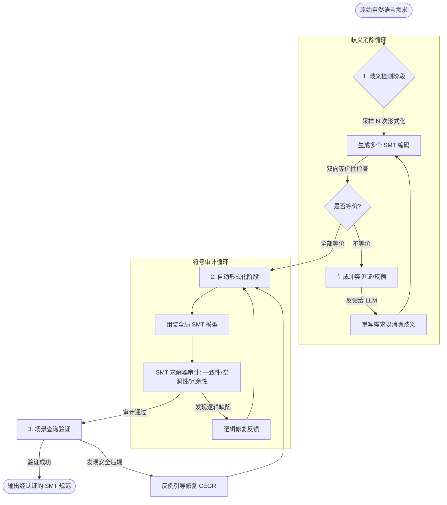

自然语言软件需求的神经符号审计

基于论文 **[Harnessing Neurosymbolic Auditing of Natural Language Software Requirements (arXiv:2605.13817)](https://arxiv.org/abs/2605.13817v1)** 的核心思想（VeriMed 框架），我为你梳理了实现该系统的逻辑流程图和伪代码。

---

### 1. 业务流程图 (Flowchart)

这个流程图展示了从原始需求到最终经过数学验证的规范的“净化”过程。



---

### 2. 核心逻辑伪代码 (Python 风格)

这段伪代码展示了如何利用 **LangChain (LLM)** 和 **Z3 (求解器)** 实现论文中最关键的 **CEGR (反例引导修复)** 和 **歧义检测**。

```python
import z3
from langchain import LLMChain, PromptTemplate

# --- 模块 1: 歧义检测 (Ambiguity Resolver) ---
def resolve_ambiguity(requirement_text, n_samples=5):
    """
    通过多次采样检测需求是否存在歧义
    """
    encodings = []
    for _ in range(n_samples):
        # 这里的 temperature 设置为 1.0 以暴露不确定性
        code = llm_formalizer.generate(requirement_text, temperature=1.0)
        encodings.append(z3.parse_smtlib2_string(code))
    
    # 两两比对等价性
    for i in range(len(encodings)):
        for j in range(i + 1, len(encodings)):
            if not check_bidirectional_equivalence(encodings[i], encodings[j]):
                # 发现歧义，获取反例并反馈重写
                witness = get_distinguishing_witness(encodings[i], encodings[j])
                new_requirement = llm_rewriter.run(requirement_text, witness)
                return resolve_ambiguity(new_requirement) # 递归直到收敛
    return requirement_text

# --- 模块 2: 反例引导修复 (CEGR) ---
def verify_and_repair(model_smt, scenario, safety_claim):
    """
    CEGR 核心循环：利用 SMT 反例强制 LLM 修复错误
    """
    solver = z3.Solver()
    solver.add(model_smt)
    solver.add(scenario)
    
    # 尝试验证：模型 + 场景 是否 蕴含 安全主张 (取反即找反例)
    solver.add(z3.Not(safety_claim))
    
    result = solver.check()
    if result == z3.unsat:
        return "Verified Safe"
    else:
        # 关键：获取具体的数学反例 (Counterexample)
        counter_example = solver.model()
        
        # 将反例作为“硬证据”发给 LLM 修复
        fixed_answer = llm_agent.run(
            original_scenario=scenario,
            violated_claim=safety_claim,
            counter_example=counter_example # 论文证明这是提效的关键
        )
        return verify_and_repair(model_smt, scenario, fixed_answer)

# --- 主程序流 ---
def verimed_pipeline(nl_requirements):
    # 1. 消除歧义
    clean_requirements = [resolve_ambiguity(r) for r in nl_requirements]
    
    # 2. 组装模型
    final_model = auto_formalizer.assemble(clean_requirements)
    
    # 3. 运行审计 (一致性、冗余等)
    audit_results = run_smt_audit(final_model)
    
    if audit_results.is_valid:
        return final_model
    else:
        handle_logic_conflicts(audit_results.unsat_core)

```

---

### 💡 技术实现要点：

1. **双层 Agent 结构**：
* **Meta-Agent**：负责分析 `solver.model()` 产生的反例，并决定如何重写提示词。
* **Worker-Agent**：负责执行具体的 SMT-LIB 代码编写任务。


2. **SMT 反例的翻译**：
* 从 Z3 拿到的模型通常是 `{temp=42.5, alarm=False}` 这种变量映射。你需要一个简单的辅助函数（或 Haiku 等小模型）将其转回人话，告诉 LLM：“看，在这个例子里，温度明明超过了限制但你的规则没报警”。


3. **收敛判定**：
* 论文提到采样 5 次 (N=5) 就能有效发现 18.8% 的隐藏歧义。


这个架构直接解决了你之前提到的“如何结合 LangChain 和 LLM”的问题，通过 **Z3 求解器** 充当了最公正的“裁判”。