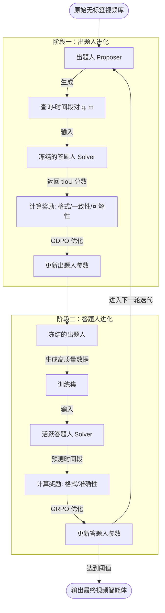

嘿！很高兴能为你讲解这篇来自 [arXiv](https://arxiv.org/html/2605.13803v1) 的有趣论文。

想象一下，你正在玩一个“拼图游戏”，但没有说明书。这篇名为 **《EvoGround：视频时间定位的自我进化智能体》** 的论文，讲的就是 AI 如何在**没有人类教它**的情况下，通过“自己跟自己玩游戏”来无师自通地看懂视频。

以下是它的核心思想：

---

### 1. 为什么要“自学”？（解决“太贵了”的问题）

以前，如果你想让 AI 知道视频里哪一秒钟是“进球”，你需要花钱请很多人手把手地告诉它：“从第 5 秒开始，到第 8 秒结束”。

* **问题：** 这太费时间、太费钱了！
* **论文观点：** [EvoGround](https://minjoong507.github.io/projects/EvoGround/) 认为 AI 应该像你一样，通过观察世界（原始视频）来自己悟出规律。

### 2. 这个游戏怎么玩？（左右手互搏）

作者把 AI 分裂成了两个性格不同的分身，让他们互相卷：

* **出题人 (Proposer)**：它盯着一段没标记过的视频，随便截一段，然后开动脑筋编一个描述。比如它截了一个小孩吹蜡烛的片段，写下：“一个小男孩吹灭了生日蛋糕上的蜡烛。”
* **答题人 (Solver)**：它拿到这段描述，要在整个长视频里精准地找出“吹蜡烛”是哪几秒。

**关键在于：** 如果答题人找对了，说明出题人出的题质量高；如果答题人找不对，出题人就要反思是不是自己描述得太烂。在这个“出题-答题-反馈”的死循环里，两个 AI 的能力都会疯狂进化。

### 3. 没有裁判，AI 怎么知道谁赢了？（奖励机制）

既然没有人类给正确答案，AI 怎么知道自己做对了？论文给它们设计了三道“关卡”：

1. **说人话奖（Format Reward）**：AI 说话必须符合格式，不能胡言乱语。
2. **对得上奖（Consistency Reward）**：利用一个叫 [SigLIP-2](https://www.google.com/search?q=https://arxiv.org/html/2502.13923v1) 的“火眼金睛”工具，检查 AI 写的文字和画面里的东西是不是真的吻合。
3. **好题奖（Feedback Reward）**：如果题目太难或者太模糊，答题人永远答不对，那这个题就是烂题。

### 4. 最终成果（学渣变学霸）

最神奇的是，这个 AI 只看了 **2500 个原始视频**（非常少），通过这种“左右手互搏”的训练，它在考试中的表现竟然**超过了**那些读了成千上万本“人类标注教材”的 AI 模型。

而且，它不仅学会了找时间，还顺便变成了一个顶级的**视频解说员**，能把视频里的细节讲得头头是道。

---

### 💡 总结给你的“大白话”：

这篇论文的核心论点就是：**AI 不一定要靠人类喂饭。给它一个合适的“竞技场”和一套互相竞争的规则，它自己就能在原始视频的海洋里，靠着“刷题”和“复盘”，进化成看片高手。**

你觉得，如果让你用这种“左右手互搏”的方法来复习数学，你会怎么给自己出题？


基于论文 **[EvoGround: Self-Evolving Video Agents for Video Temporal Grounding](https://arxiv.org/html/2605.13803v1)** 的核心思想，我为你梳理了实现该系统的逻辑流程图和伪代码。

---

### 1. 业务流程图 (Flowchart)

这个流程图展示了“出题人”与“答题人”如何通过强化学习（RL）实现左右手互搏。



---

### 2. 核心逻辑伪代码 (Python 风格)

这段伪代码展示了如何利用 **强化学习 (RL)** 驱动两个 Agent 协同进化。

```python
import torch
from model import VideoLLM  # 初始模型，如 Qwen2.5-VL

class EvoGround:
    def __init__(self, raw_videos):
        self.videos = raw_videos
        # 初始时，出题人和答题人共享同一个大脑
        self.proposer = VideoLLM.load_pretrained()
        self.solver = VideoLLM.load_pretrained()
        self.delta = 0.0  # 难度阈值，随迭代增加

    def train_proposer_step(self, video):
        """出题人进化循环"""
        # 1. 出题人生成多个候选：(描述 q, 时间段 m)
        candidates = self.proposer.generate_pairs(video, n=8)
        
        # 2. 评估奖励
        # R_fmt: 格式对不对？时间段合不合理？
        r_format = check_format(candidates, video.duration)
        
        # R_con: 利用 SigLIP-2 检查文字和画面是否真的对得上
        r_consistency = calculate_siglip_similarity(candidates, video)
        
        # R_feed: 让‘冻结的答题人’试着解题，看题难不难
        with torch.no_grad():
            predictions = self.solver.predict(video, [c.q for c in candidates])
            r_feedback = calculate_tIoU(predictions, [c.m for c in candidates])
        
        # 3. 使用 GDPO 更新出题人 (强化学习)
        total_reward = w1*r_format + w2*r_consistency + w3*r_feedback
        self.proposer.rl_update(total_reward)

    def train_solver_step(self, video):
        """答题人进化循环"""
        # 1. 使用‘进化后的出题人’生成高质量练习题
        with torch.no_grad():
            training_data = self.proposer.generate_pairs(video)
        
        # 2. 答题人尝试解题
        results = self.solver.forward_with_rollout(video, training_data.queries)
        
        # 3. 计算准确性奖励 (tIoU)
        r_acc = calculate_tIoU(results, training_data.moments)
        
        # 4. 使用 GRPO 更新答题人
        self.solver.rl_update(r_acc)

    def evolve(self, iterations=3):
        for i in range(iterations):
            self.delta = [0.0, 0.3, 0.5][i] # 逐步提高难度，要求更精准的对齐
            for video in self.videos:
                self.train_proposer_step(video)
            for video in self.videos:
                self.train_solver_step(video)

```

---

### 💡 技术要点提示：

1. **[GDPO 优化器](https://www.google.com/search?q=https://arxiv.org/html/2605.13803v1%233.3)**：论文提到由于出题人有三个不同的奖励（格式、一致性、反馈），直接相加会相互干扰，所以用了 GDPO 对每个奖励单独归一化，防止“容易的奖励”占主导。
2. **[tIoU (时间交并比)](https://www.google.com/search?q=https://arxiv.org/html/2605.13803v1%233.1)**：这是评估“找得准不准”的核心指标。它不仅看重叠面积，还惩罚了开始时间和结束时间的偏差。
3. **[SigLIP-2](https://www.google.com/search?q=https://arxiv.org/html/2502.13923v1)**：这是代码实现中的“视觉法官”，用来确保 AI 编出的文字描述不是在瞎说，而是确实出现在画面里的。

这种架构让 AI 在不需要人类昂贵标注的情况下，通过“自我卷动”实现了性能的飞跃。你觉得这个“出题人-答题人”的模式，在前端开发测试中可以怎么借用？