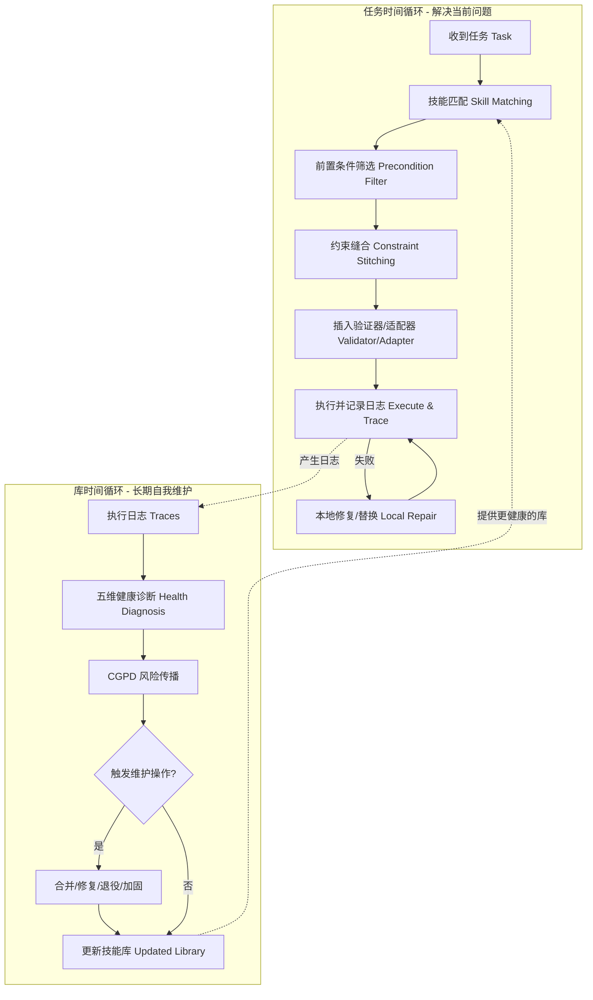

嘿！这篇论文 [SkillOps: Managing LLM Agent Skill Libraries as Self-Maintaining Software Ecosystems](https://arxiv.org/html/2605.13716v1) 提出的想法非常硬核，它把 AI 助手比作一个正在不断成长的“技能社区”。

想象一下你正在玩一个大型网游，你的角色学了 1000 个技能。但问题来了：有些技能过时了，有些技能跟别的技能冲突，还有些技能描述得不清不楚。这篇论文讲的就是如何给 AI 雇一个“全职管家”，专门负责维护它的技能库。

以下是它的三个关键思想：

---

### 1. 什么是“技能技术债”？（技能也会变“臭”）

**场景：** 你教 AI 写了一个“发送邮件”的技能。后来你换了邮件服务器，或者增加了一个“加密邮件”的新技能。

* **问题：** 老技能没删，新技能又跟老技能长得特别像。AI 在用的时候就会纠结：“我该用哪一个？”或者它选了一个已经坏掉的老技能。
* **核心论点：** 这种混乱叫“技能技术债 (Skill Technical Debt)”。如果技能库里充满了垃圾、重复和不兼容的代码，AI 就会变得越来越笨。

### 2. 技能合同（Skill Contract）：给每个技能发“护照”

**做法：** 论文提出，每一个技能不能只是一段代码，它必须有一个“合同”。这个合同包含五样东西：

* **P (Preconditions)**：使用前必须满足什么条件？（比如：必须先登录）
* **O (Operation)**：具体怎么干活？（代码本身）
* **A (Artifacts)**：干完活会产出什么？（比如：一封已发送的邮件）
* **V (Validators)**：怎么检查活儿干得对不对？（比如：查一下发件箱）
* **F (Failure Modes)**：如果搞砸了，通常是怎么砸的？

有了这本“护照”，系统就能像安检员一样，在 AI 干活前就判断这个技能靠不靠谱，能不能跟下一个技能对接上。

### 3. SkillOps：自动化的“技能环卫工”

**做法：** 论文设计了一个叫 **SkillOps** 的系统，它会在后台不停地做五件事（健康诊断）：

* **合并 (Merge)**：发现两个技能长得几乎一样？合并成一个。
* **修理 (Repair)**：发现某个技能老是报错？根据报错日志自动修好它。
* **退休 (Retire)**：发现某个技能一年没人用了，或者一直修不好？直接删掉。
* **补漏洞 (Add Validator/Adapter)**：发现两个技能中间连不上？自动加个“转接头”。

---

### 💡 总结给你的“备忘录”：

这篇论文最牛的地方在于：它认为**维护技能库**和**使用技能**同样重要。

以往我们只是教 AI “怎么做事”，而 [SkillOps](https://github.com/Hik289/SkillOps.git) 是教 AI **“如何打理自己的工具箱”**。实验证明，有了这个“自动管家”，AI 在处理复杂任务时的成功率提升了 **8.8%**，而且因为它提前把垃圾清理了，AI 思考时耗费的“脑力”（Token 成本）反而变低了。

这就像是你不仅在学习知识，还在定期整理你的思维导图和笔记——**整理得越好，你反应就越快。**

你觉得，如果一个 AI 拥有无限的技能但从不整理，它最后会变成什么样？


根据你分享的论文 **[SkillOps: Managing LLM Agent Skill Libraries as Self-Maintaining Software Ecosystems](https://arxiv.org/abs/2605.13716v1)** 以及其 [官方开源代码库](https://github.com/Hik289/SkillOps)，我为你整理了该系统的核心架构流程图和实现伪代码。

### 1. SkillOps 全流程架构图

SkillOps 的核心在于 **“双循环”架构**：左侧是处理当前任务的“任务时间循环”，右侧是负责长期维护的“库时间循环”。



---

### 2. 核心逻辑实现代码 (基于论文算法)

根据论文中提到的 [Algorithm 3 & 4](https://www.google.com/search?q=https://arxiv.org/html/2605.13716v1%23A)，以下是使用 Python 模拟其核心逻辑的代码：

#### A. 技能契约 (Skill Contract) 定义

```python
from dataclasses import dataclass, field
from typing import List, Callable, Any

@dataclass
class SkillContract:
    id: str
    preconditions: List[str]  # P: 使用前必须满足的条件
    operation: Callable       # O: 实际执行的代码
    artifacts: List[str]      # A: 产出的物品/结果类型
    validator: Callable       # V: 验证结果的函数
    failure_modes: List[str]  # F: 已知的失败坑点

```

#### B. 库时间维护逻辑 (Library-Time Maintenance)

这是论文中最精华的部分，它通过“诊断”来修复技术债。

```python
class SkillOpsEngine:
    def __init__(self, library):
        self.library = library # 这是一个 HSEG (层级技能生态系统图)

    def run_maintenance_pass(self, execution_logs):
        # 1. 五维健康检查
        for skill in self.library.skills:
            u = self.calc_utility(skill, execution_logs)    # 实用性
            r = self.calc_redundancy(skill)                 # 冗余度
            c = self.calc_compatibility(skill)              # 兼容性
            f = self.calc_failure_risk(skill)               # 故障风险
            g = 1 if not skill.validator else 0             # 验证缺口
            
            # 2. 执行维护动作
            if r > 0.8: 
                self.merge_redundant(skill) # 合并雷同技能
            if f > 0.5: 
                self.repair_skill(skill)    # 修复高频报错
            if u < 0.1: 
                self.retire_skill(skill)    # 踢出没用的技能
            if g == 1: 
                self.add_validator(skill)   # 自动补全验证逻辑

    def add_adapter(self, skill_a, skill_b):
        """当 A 的输出和 B 的输入不完全匹配时，自动插入‘转接头’"""
        # 对应论文中的 Constraint Stitching 逻辑
        pass

```

---

### 💡 技术实现要点 (对你的项目有帮助)：

1. **HSEG 图结构**：你在开发时，不要只把技能存在 List 里，要存在一个有向图里。边（Edges）要分为：`dependency`（依赖）、`compatibility`（兼容）、`redundancy`（冗余）。
2. **CGPD 算法**：这是论文的一个高级功能。如果一个上游技能（比如“登录”）经常报错，那么所有依赖它的下游技能（比如“发帖”）的风险分都会被自动拉高，从而触发提前加固。
3. **零成本维护**：论文提到他们的 [V4 版本实现](https://www.google.com/search?q=https://arxiv.org/html/2605.13716v1%23G) 大部分是基于规则的（如哈希对比），这意味着你不需要为了维护技能库而频繁调用昂贵的 LLM API，系统可以自己跑脚本完成。

你可以参考 [SkillOps GitHub 仓库](https://github.com/Hik289/SkillOps) 中的 `skillops/skill_graph.py` 来实现这些数据结构。你打算先实现“自动合并冗余”还是“自动插入验证器”的功能？