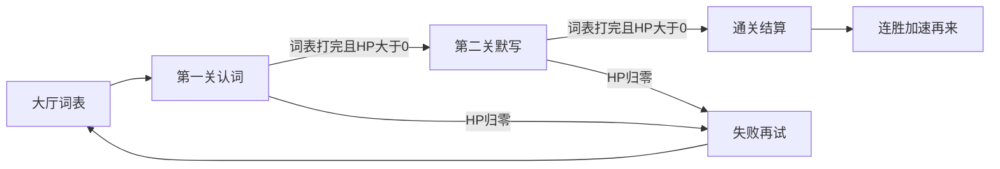

# 单词怪兽 PRD

给实现用的设计说明。单局 3–8 分钟，面向小学英语认词和默写。核心循环是「看见词 → 打出英文 → 豌豆点名击杀」。奖励只强化打对，不给免费击杀。角色沿用涂鸦木屋、原创豌豆和单词怪兽，不使用马里奥或植物大战僵尸的官方形象、贴图、音效。

失败要短、能立刻再试。除「木屋被攻破」外，必须有通关结算。

## 产品与受众

- 孩子：打字保卫木屋，在短局里把词表认完、再默写一遍。
- 家长：在大厅录入词表，调节每批数量和基础移动速度。
- 场景：博客静态页小游戏，无账号、无联网对战。

## 核心循环

1. 单词怪兽从右侧持牌子靠近木屋。
2. 玩家对场上可见怪兽的英文做前缀匹配；拼完则对该只发射豌豆。
3. 打对：击杀、朗读英文、该词从本关牌堆移除。
4. 打错：清空缓冲，豌豆短暂僵直，不扣木屋血。
5. 怪兽贴上植株：扣木屋 HP；该词不算过关，回到牌堆末尾。

同一份家长词表连打两关：先认词、后默写。不要做成无限复用词表的无尽波。

## 通关条件

本关通关：木屋 HP > 0，且本关牌堆已清空（每个词都成功击杀一次）。

本局通关：第一关和第二关都通关。

验收：

- 词表当作一副牌。每个词每关只因「打对击杀」消耗一次。
- 场上同时存在的怪兽数量不超过大厅「每批单词怪兽」。
- 怪兽漏到植株只扣血，该词必须回到牌堆末尾，不能算出过。
- 牌没打完时，不得把已在场或已过关的词循环复用成新怪（禁止当前 `pickWord` 在用尽后回到全词表抽取）。
- 牌堆空、场上无活怪、HP > 0，才进入下一关或通关结算。

## 关卡

### 第一关 认词

- 牌子：英文在上、中文在下（与现有一致）。
- 输入：打出英文。
- 速度：家长滑条 × 连胜系数。

过关后短过场，进入第二关。木屋 HP 带入第二关，不回满。

### 第二关 默写（下一关）

- 牌子：只显示中文，不显示英文。
- 输入：仍打英文。匹配规则与第一关相同（对英文做前缀匹配）。
- 速度：在第一关有效速度上再乘约 0.85（回忆比再认难，给一点思考时间）。
- 词表：同一份牌重新洗开，规则与第一关相同。

验收：第二关场上牌子不得出现英文；打对后仍朗读英文。

## 失败与再试

任一一关木屋 HP 到 0 即失败。

- 保留现有失败 overlay。
- 文案须带本关进度，例如「还剩 6 个词没打对」。
- 提供立刻再试（用原词从第一关重来）和回大厅改词。
- 失败清连胜。

## 更多可玩性设计

### 连击与临时加成

连续打对累计连击。打错或漏怪（贴上植株）清零。

| 连击 | 效果                                            |
| ---- | ----------------------------------------------- |
| 3    | 豌豆发亮                                        |
| 5    | 怪兽脚底「墨水粘住」约 3 秒（全体减速），可刷新 |
| 8    | 木屋少量回血，HP 不超过上限                     |

验收：连击加成不得直接击杀或清场。

### 图鉴收集

击败过的怪兽种类写入本地。图鉴卡片标记「见过 / 击败过」。不新增抽卡、商店、解锁墙。

### 连胜加难

两关都过：连胜 +1。下一局有效速度 = 家长速度滑条 × `1.08 ^ 连胜`，上限约 1.5× 家长值。失败清零。每批数量仍只由家长输入框决定。

### 汤姆大叔口播

用 `speechSynthesis` 中文短句，与击杀时的英文朗读错开、不叠读。

- 开第一关：怪兽拿着单词牌冲过来了，帮我看着木屋。
- 进第二关：这次牌子只写中文，英文要你自己想出来。
- 5 连击：写得真准，墨水把它们的脚粘住了。
- 通关：木屋保住了。
- 失败：木屋要重修了，我们再试一次。

## 进度与结算

HUD 增加：关卡名（认词 / 默写）、`已打对 / 词表总数`、连击。保留木屋 HP 与拼写缓冲。

通关 overlay（需新增，现仅有失败界面）按**第二关结束时**评 1–3 星，只作反馈，不锁关：

- 1 星：本局通关
- 2 星：结束时 HP > 50%
- 3 星：第二关无漏怪（没有怪兽贴上植株）

## 界面与 HUD

- 大厅：词表、每批数量、基础速度、图鉴入口、开始。开始进入第一关。
- 局内：关卡名、进度分数、连击、HP、拼写、僵直提示。
- 关间过场：一句说明后进入默写，可自动或点按钮继续。
- 暂停：继续、编辑词表、图鉴、重新开始（从第一关）。
- 胜利：星级、击杀数、连胜、再来一局、回大厅。
- 失败：进度、再试、改词。

## 非目标

- 每日签到、体力、商店、账号、排行榜
- 免费清怪、炸弹、自动完成单词
- 无尽模式、多世界地图
- 第三方游戏 IP 的形象、贴图、音效

## 实现备注

本文件先定设计，实现时再改代码。要点：

- 将随机复用词表改为本关牌堆；漏怪回队尾。
- 新增胜利 overlay 与关间过场；HUD 进度与连击。
- 第二关 `drawWordCard` 只画中文。
- 连击状态（发光、减速、回血）写在 `game.js`，不新增道具栏。
- 图鉴击败记录、连胜记录用 `localStorage`（可与现有 `oasis-word-zombie-*` 并列新键）。
- 口播与 `speakWord` 排队，避免中英文同时播。
