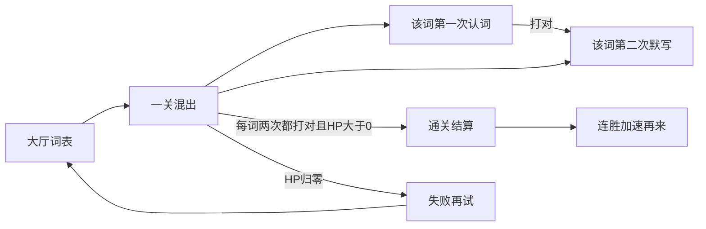

# 单词怪兽 PRD

给实现用的设计说明。单局 3–8 分钟，面向小学英语认词和默写。核心循环是「看见词 → 打出英文 → 豌豆点名击杀」。奖励只强化打对，不给免费击杀。角色沿用涂鸦木屋、原创豌豆和单词怪兽，不使用马里奥或植物大战僵尸的官方形象、贴图、音效。

失败要短、能立刻再试。除「木屋被攻破」外，必须有通关结算。

关卡不按「认词关 / 默写关」拆成两关。同一局里，每个单词出现两次：第一次认词，第二次默写。两种牌子可以同时在场。

## 产品与受众

- 孩子：打字保卫木屋，在一局里把词表每个词先认一遍、再默写一遍。
- 家长：在大厅录入词表，调节每批数量和基础移动速度。
- 场景：博客静态页小游戏，无账号、无联网对战。

## 核心循环

1. 单词怪兽从右侧持牌子靠近木屋。
2. 玩家对场上可见怪兽的英文做前缀匹配；拼完则对该只发射豌豆。
3. 打对：击杀、朗读英文；该次出现从牌堆消耗。
4. 打错：清空缓冲，豌豆短暂僵直，不扣木屋血。
5. 怪兽贴上植株：扣木屋 HP；该次出现不算过，按原模式回到牌堆末尾。

同一份家长词表打一关。不要做成无限复用词表的无尽波，也不要切到另一关才开始默写。

## 通关条件

本关 / 本局通关：木屋 HP > 0，且词表里每个词都成功击杀两次（先认词，后默写）。

验收：

- 词表当作一副牌。每个词有两次必须打对的出现：第 1 次认词，第 2 次默写。
- 某词只有打对认词之后，才允许再刷出它的默写。
- 场上同时存在的怪兽数量不超过大厅「每批单词怪兽」。认词怪和默写怪可混在同一批里。
- 怪兽漏到植株只扣血；该次出现按**当前模式**回到牌堆末尾（认词漏了仍是认词，默写漏了仍是默写），不能算该次已过。
- 牌没打完时，不得把未到次数的词循环复用成额外新怪（禁止当前 `pickWord` 在用尽后回到全词表抽取）。
- 两次出现都打完、场上无活怪、HP > 0，进入通关结算。

## 关卡

只有一关，不设认词关、默写关，不设关间过场。

### 同一词的两次出现

**第一次：认词**

- 牌子：英文在上、中文在下（与现有一致）。
- 输入：打出英文。
- 速度：家长滑条 × 连胜系数。

**第二次：默写**

- 牌子：只显示中文，不显示英文。
- 输入：仍打英文。匹配规则不变（对英文做前缀匹配）。
- 速度：该只怪兽在认词有效速度上再乘约 0.85（回忆比再认难）。
- 出场：仅当该词的认词已被打对。

验收：

- HUD、标题、过场都不得把本局标成「第 1 关认词 / 第 2 关默写」。
- 默写牌子不得出现英文；打对后仍朗读英文。
- 词表 3 个词则本关需打对 6 次；进度分母为 `词表数 × 2`。

### 出牌顺序

建议实现：认词牌先洗入待发堆；某词认词被击杀后，把它的默写牌追加到队尾（或插入偏后位置），让孩子先见词、隔一会儿再默写，而不是立刻同一词连刷两次。场上仍受每批上限约束。

## 失败与再试

木屋 HP 到 0 即失败。

- 保留现有失败 overlay。
- 文案须带本关进度，例如「还剩 6 次没打对」（含未完成的认词和默写）。
- 提供立刻再试（用原词重来本关）和回大厅改词。
- 失败清连胜。

## 更多可玩性设计

### 连击与临时加成

连续打对累计连击（认词、默写都算）。打错或漏怪（贴上植株）清零。

| 连击 | 效果                                            |
| ---- | ----------------------------------------------- |
| 3    | 豌豆发亮                                        |
| 5    | 怪兽脚底「墨水粘住」约 3 秒（全体减速），可刷新 |
| 8    | 木屋少量回血，HP 不超过上限                     |

验收：连击加成不得直接击杀或清场。

### 图鉴收集

击败过的怪兽种类写入本地。图鉴卡片标记「见过 / 击败过」。不新增抽卡、商店、解锁墙。

### 连胜加难

本关通关：连胜 +1。下一局有效速度 = 家长速度滑条 × `1.08 ^ 连胜`，上限约 1.5× 家长值。失败清零。每批数量仍只由家长输入框决定。

### 汤姆大叔口播

用 `speechSynthesis` 中文短句，与击杀时的英文朗读错开、不叠读。

- 开局：怪兽拿着单词牌冲过来了，帮我看着木屋。
- 场上出现本局第一只默写怪：有的牌子只剩中文了，英文要你自己想。
- 5 连击：写得真准，墨水把它们的脚粘住了。
- 通关：木屋保住了。
- 失败：木屋要重修了，我们再试一次。

## 进度与结算

HUD 增加：`已打对 / (词表总数 × 2)`、连击。可用小标记区分本次是认词还是默写（例如默写牌角标「默」），但不要做成两关名称。保留木屋 HP 与拼写缓冲。

通关 overlay（需新增，现仅有失败界面）按本关结束时评 1–3 星，只作反馈，不锁关：

- 1 星：本关通关
- 2 星：结束时 HP > 50%
- 3 星：本关无漏怪（没有怪兽贴上植株）

## 界面与 HUD

- 大厅：词表、每批数量、基础速度、图鉴入口、开始。开始进入本关。
- 局内：进度（已打对 / 总次数）、连击、HP、拼写、僵直提示。
- 暂停：继续、编辑词表、图鉴、重新开始（重开本关）。
- 胜利：星级、击杀数、连胜、再来一局、回大厅。
- 失败：进度、再试、改词。
- 不要关间过场，不要「进入默写关」按钮。

## 非目标

- 每日签到、体力、商店、账号、排行榜
- 免费清怪、炸弹、自动完成单词
- 把认词和默写硬拆成两关或两张地图
- 无尽模式、多世界地图
- 第三方游戏 IP 的形象、贴图、音效

## 实现备注

本文件先定设计，实现时再改代码。要点：

- 将随机复用词表改为本关牌堆：每词最多两次出现，先认后默；漏怪按当前模式回队尾。
- 新增胜利 overlay；HUD 进度分母为词数 × 2。
- `drawWordCard` 按该只怪兽的模式画：认词英+中，默写只中文。
- 连击状态（发光、减速、回血）写在 `game.js`，不新增道具栏。
- 图鉴击败记录、连胜记录用 `localStorage`（可与现有 `oasis-word-zombie-*` 并列新键）。
- 口播与 `speakWord` 排队，避免中英文同时播。
