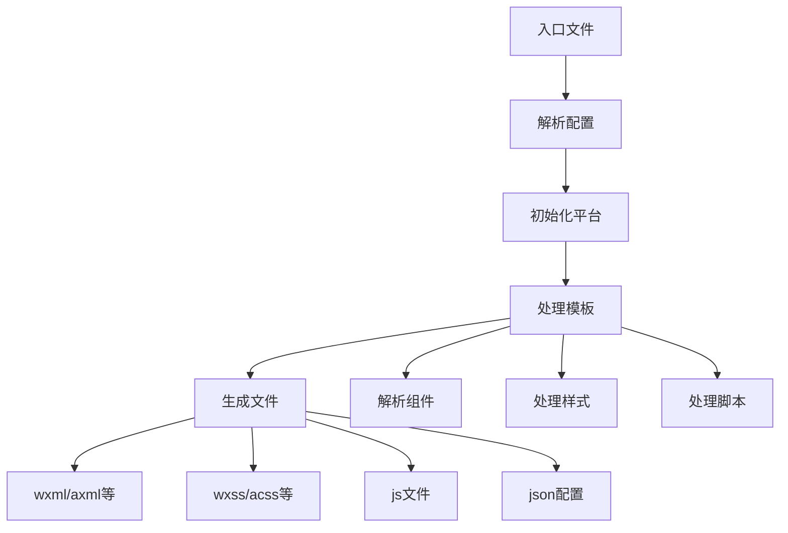
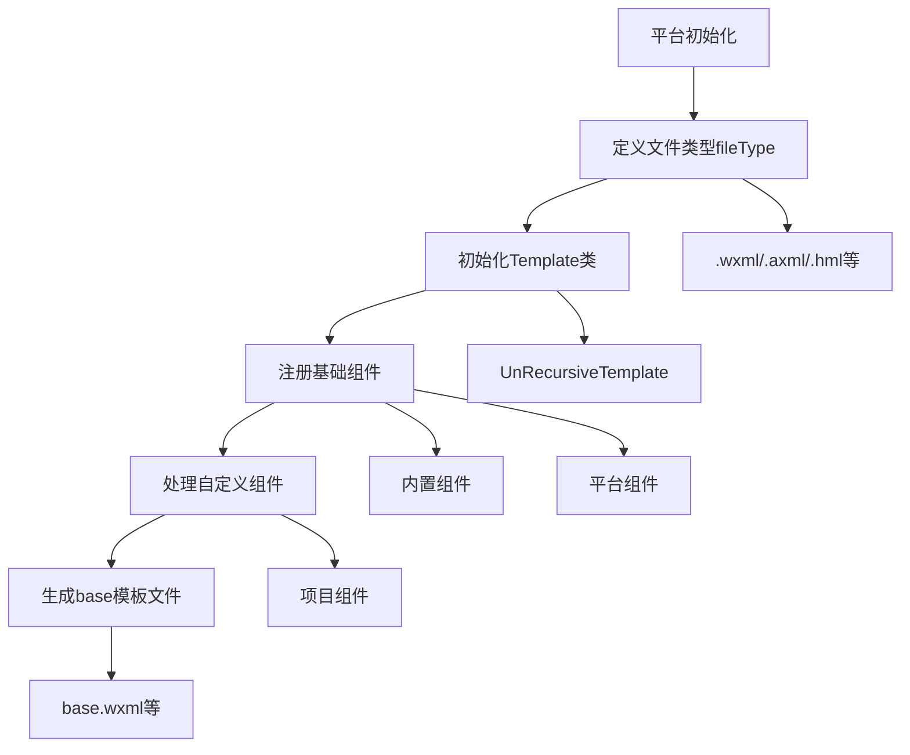

## 一、入口文件处理与模板编译流程

### 1.1 入口文件处理

入口文件处理主要在 `Config` 类中进行，位于 `packages/taro-service/src/Config.ts`：

```typescript
getConfigWithNamed (platform, configName) {
  const initialConfig = this.initialConfig
  const sourceDirName = initialConfig.sourceRoot || SOURCE_DIR
  const outputDirName = initialConfig.outputRoot || OUTPUT_DIR
  const sourceDir = path.join(this.appPath, sourceDirName)
  const entryName = ENTRY
  const entryFilePath = resolveScriptPath(path.join(sourceDir, entryName))

  const entry = {
    [entryName]: [entryFilePath]
  }
}
```

**处理逻辑：**
- 获取源码目录（默认 `src`）
- 获取入口文件路径（默认 `app`）
- 构建 webpack entry 配置

### 1.2 平台模板处理

微信小程序平台的模板处理在 `Weapp` 类中，位于 `packages/taro-platform-weapp/src/program.ts`：

```typescript
constructor (ctx, config, pluginOptions?: IOptions) {
  super(ctx, config)
  this.template = new Template(pluginOptions)
  this.setupTransaction.addWrapper({
    close () {
      this.modifyTemplate(pluginOptions)
      this.modifyWebpackConfig()
    }
  })
}
```

### 1.3 模板编译流程



### 1.4 base.wxml 的生成过程

`base.wxml` 的生成过程位于 `packages/taro-webpack5-runner/src/webpack/MiniWebpackPlugin.ts`：

**1. 模板初始化**

```typescript
class Template {
  constructor() {
    this.voidElements = new Set()
    this.focusComponents = new Set()
    this.components = new Map()
  }
}
```

**2. 组件注册**

```typescript
modifyTemplate() {
  template.mergeComponents(this.ctx, components)
  template.voidElements.add('voip-room')
  template.focusComponents.add('editor')
}
```

**3. 模板生成**

```typescript
buildTemplate() {
  // 1. 基础组件
  const baseComponents = this.getBaseTemplate()
  
  // 2. 自定义组件
  const customComponents = this.getCustomComponents()
  
  // 3. 合并模板
  return this.mergeTemplate(baseComponents, customComponents)
}
```

**4. 文件输出**

```typescript
writeFile() {
  const template = this.buildTemplate()
  fs.writeFileSync(
    path.join(outputPath, 'base.wxml'),
    template
  )
}
```

## 二、构建配置与框架适配

### 2.1 环境变量和常量定义

webpack 构建时的环境变量处理，位于 `packages/taro-webpack5-runner/src/webpack/MiniWebpackPlugin.ts`：

```typescript
getDefinePlugin () {
  const {
    env = {},
    runtime = {} as Record<string, boolean>,
    defineConstants = {},
    framework = 'react',
    buildAdapter = PLATFORMS.WEAPP
  } = this.combination.config

  env.FRAMEWORK = JSON.stringify(framework)
  env.TARO_ENV = JSON.stringify(buildAdapter)
  env.TARO_PLATFORM = JSON.stringify(process.env.TARO_PLATFORM || PLATFORM_TYPE.MINI)
  env.SUPPORT_TARO_POLYFILL = env.SUPPORT_TARO_POLYFILL || '"disabled"'
  
  const envConstants = Object.keys(env).reduce((target, key) => {
    target[`process.env.${key}`] = env[key]
    return target
  }, {})

  const runtimeConstants = {
    ENABLE_INNER_HTML: runtime.enableInnerHTML ?? true,
    ENABLE_ADJACENT_HTML: runtime.enableAdjacentHTML ?? false,
    ENABLE_SIZE_APIS: runtime.enableSizeAPIs ?? false,
    ENABLE_TEMPLATE_CONTENT: runtime.enableTemplateContent ?? false,
    ENABLE_CLONE_NODE: runtime.enableCloneNode ?? false,
    ENABLE_CONTAINS: runtime.enableContains ?? false,
    ENABLE_MUTATION_OBSERVER: runtime.enableMutationObserver ?? false
  }

  return WebpackPlugin.getDefinePlugin([envConstants, defineConstants, runtimeConstants])
}
```

**定义的常量包括：**
- 框架类型（`FRAMEWORK`）
- 运行时环境（`TARO_ENV`、`TARO_PLATFORM`）
- 平台相关常量
- 功能开关（各种 `ENABLE_*` 标志）

### 2.2 框架适配层

以 React 为例，位于 `packages/taro-webpack5-runner/src/webpack/MiniWebpackPlugin.ts`：

```typescript
export default (ctx: IPluginContext) => {
  const { framework = 'react' } = ctx.initialConfig

  if (!isReactLike(framework)) return

  ctx.modifyWebpackChain(({ chain }) => {
    // 通用
    setAlias(framework, chain)

    if (process.env.TARO_PLATFORM === 'web') {
      // H5
      modifyH5WebpackChain(ctx, framework, chain)
    } else if (process.env.TARO_PLATFORM === 'harmony' || process.env.TARO_ENV === 'harmony') {
      // 鸿蒙
      modifyHarmonyWebpackChain(ctx, framework, chain)
    } else {
      // 小程序
      modifyMiniWebpackChain(ctx, framework, chain)
    }
  })
}
```

**主要逻辑：**
- 注入框架特定配置
- 修改 webpack 配置
- 处理平台差异（H5、鸿蒙、小程序）

### 2.3 构建配置合并

在 `MiniCombination` 中进行最终的构建配置处理，位于 `packages/taro-webpack5-runner/src/webpack/MiniCombination.ts`：

```typescript
process (config: Partial<IMiniBuildConfig>) {
  const baseConfig = new MiniBaseConfig(this.appPath, config)
  const chain = this.chain = baseConfig.chain
  const {
    entry = {},
    output = {},
    mode = 'production',
    globalObject = 'wx',
    sourceMapType = 'cheap-module-source-map',
    fileType = {
      style: '.wxss',
      config: '.json',
      script: '.js',
      templ: '.wxml'
    },
    /** special mode */
    isBuildPlugin = false,
    /** hooks */
    modifyComponentConfig,
    optimizeMainPackage
  } = config

  this.fileType = fileType

  modifyComponentConfig?.(componentConfig, config)

  if (isBuildPlugin) {
    // 编译目标 - 小程序原生插件
    this.isBuildPlugin = true
    this.buildNativePlugin = BuildNativePlugin.getPlugin(this)
    chain.merge({
      context: path.join(process.cwd(), this.sourceRoot, 'plugin')
    })
  }

  if (optimizeMainPackage) {
    this.optimizeMainPackage = optimizeMainPackage
  }

  const webpackEntry = this.getEntry(entry)
  const webpackOutput = this.getOutput({
    publicPath: '/',
    globalObject,
    isBuildPlugin,
    output
  })
}
```

**处理内容包括：**
1. 基础配置
2. 文件类型配置
3. 插件配置
4. 入口输出配置

## 三、模板类型定义

### 3.1 文件类型定义

首先在平台类中定义文件类型，位于 `packages/taro-platform-weapp/src/program.ts`：

```typescript
fileType = {
  templ: '.wxml',
  style: '.wxss',
  config: '.json',
  script: '.js',
  xs: '.wxs'
}
```

不同平台有自己的文件扩展名（微信 `.wxml`，支付宝 `.axml`，鸿蒙 `.hml` 等）。

### 3.2 模板类继承结构

模板类继承自 `UnRecursiveTemplate`，类型定义位于 `packages/taro-weapp/types/index.d.ts`：

```typescript
declare class Template extends UnRecursiveTemplate {
  pluginOptions: IOptions;
  supportXS: boolean;
  Adapter: {
    if: string;
    else: string;
    elseif: string;
    for: string;
    forItem: string;
    forIndex: string;
    key: string;
    xs: string;
    type: string;
  };
  transferComponents: Record<string, Record<string, string>>;
  constructor(pluginOptions?: IOptions);
  buildXsTemplate(filePath?: string): string;
  createMiniComponents(components: any): any;
  replacePropName(name: string, value: string, componentName: string, componentAlias: any): string;
  buildXSTepFocus(nn: string): string;
  modifyTemplateResult: (res: string, nodeName: string, _: any, children: any) => string;
  buildPageTemplate: (baseTempPath: string, page: any) => string;
}
```

**核心方法：**
- `buildXsTemplate`: 构建 wxs 模板
- `createMiniComponents`: 创建小程序组件
- `buildPageTemplate`: 构建页面模板

### 3.3 模板初始化与组件注册

**1. 在平台类的构造函数中初始化模板**

```typescript
constructor (ctx, config, pluginOptions?: IOptions) {
  super(ctx, config)
  this.template = new Template(pluginOptions)
  this.setupTransaction.addWrapper({
    close () {
      this.modifyTemplate(pluginOptions)
      this.modifyWebpackConfig()
    }
  })
}
```

**2. 通过 `modifyTemplate` 方法注册和修改组件**

```typescript
modifyTemplate (pluginOptions?: IOptions) {
  const template = this.template
  template.mergeComponents(this.ctx, components)
  template.voidElements.add('voip-room')
  template.focusComponents.add('editor')
  if (pluginOptions?.enablekeyboardAccessory) {
    template.voidElements.delete('input')
    template.voidElements.delete('textarea')
  }
}
```

**3. 在构建过程中，通过 `MiniWebpackPlugin` 处理模板相关的配置**

`packages/taro-webpack5-runner/src/webpack/MiniWebpackPlugin.ts` 负责处理模板配置。

`packages/taro-webpack5-runner/src/plugins/MiniPlugin.ts` 负责生成小程序相关文件。

### 3.4 模板类型确定流程


